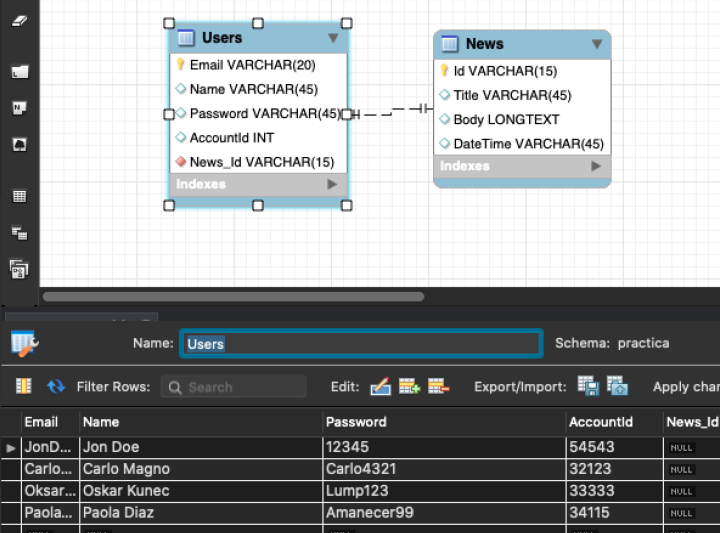

# SQLi

On this repository I will show a little example of a SQL Injection.

## What I want to achieve?

I want to see if I’m able get confidential data from a web app by interfering with queries. 

## How I will achieve it?

By using SQL attacks to a simple web that connects to a MySQL DB.

<b>DB creation</b>

I’ve created the data base using MySQL Workbench 8.0. The DB consists of 2 basic tables, USERS and NEWS.
The USERS table contains the following user information:
- Email Address
- User Name
- Password
- Account ID
- News ID
  


The News table contains:
- News ID
- News Title
- News Text
- Date


<b>Web environment creation</b><br>
I’ve used Visual Studio Code with a PHP extension. The code will be available separately in this repo.


A local version of the web can be laucnhed via the PHP extenison in Visual Studio Code:


The INDEX of the page would look like this:


Snapshot of part of the code:

```
<?php
// Get parameter
$id=$_GET['id'];
$sql = "SELECT * FROM News WHERE Id=$id;";
$result = mysqli_query($conn, $sql);
$resultCheck = mysqli_num_rows($result);
if ($resultCheck > 0){
while($row = mysqli_fetch_assoc($result)){
echo $row['Title']."<br><br>";;
echo $row['DateTime']."<br><br>";
echo $row['Body']."<br>";
}
}
?>
```

Before proceeding further on my example, I would like to explain I bit what exactly is SQLi and the differences it has with Blind SQLi.

## SQLi vs BLIND SQLi?

SQLi (SQL Injection) and Blind SQLi (Blind SQL Injection) are both types of security vulnerabilities that occur in web applications and can be exploited by attackers to gain unauthorized access to a database or retrieve sensitive information. However, they differ in how they are executed and the level of information an attacker can extract.  

SQL Injection (SQLi): SQL Injection is a common web application vulnerability that occurs when an attacker can manipulate or inject malicious SQL code into an application's input fields. This happens when the application does not properly validate or sanitize user input before using it in SQL queries. As a result, the attacker can modify the SQL query to execute arbitrary database commands.
Example: Consider a login form where a user enters their username and password. If the application does not validate user input properly, an attacker can enter the following in the password field:
```
' OR '1'='1
```

If the application concatenates the input directly into the SQL query, this input would make the query always return true, allowing the attacker to log in without a valid password.

Blind SQL Injection (Blind SQLi): Blind SQL Injection is a variation of SQL Injection where the application does not directly display the results of the SQL query to the attacker. In this case, the attacker can still inject malicious SQL code, but they may not see the results directly. Instead, they use Boolean-based or time-based techniques to infer information from the application's behavior.
Example: In a blind SQLi attack, an attacker may inject code that checks whether a specific condition is true or false. For instance:
```
' OR 1=1 --
```
The attacker may not see the query results, but if the application behaves differently when the condition is true (e.g., a page loads successfully) or false (e.g., an error message appears), they can deduce information about the database structure or data.
In summary, the main difference between SQL Injection and Blind SQL Injection is in how the attacker interacts with the application's response. SQL Injection allows the attacker to directly see and manipulate the query results, while Blind SQL Injection relies on the attacker inferring information from the application's behavior without direct access to the results. Both vulnerabilities are serious security threats and should be mitigated through proper input validation and parameterized queries in web applications.

So, after this short explanation, let's go back to track! 😄

After setting the environment for this lab, I had to answer a set of questions.

1) Create a view or page to show a specific news item to through a parameter called id. This parameter will be consulted via an HTTP GET method. As an example, the following is indicated http://localhost/news?id=3, where id is the attribute of the News table and the value 3 corresponds to a table record. For example:


